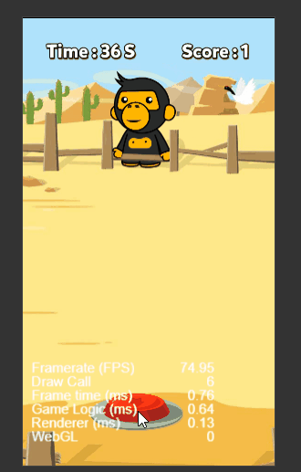
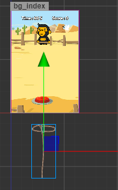
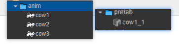

人类早期训化cocos引擎珍贵项目


## 游戏成品演示



 


## 功能实现



### 资源准备

准备好牛的预制体 以及 不同种牛的 奔跑帧动画




### 点击按钮实现绳子伸缩的动作

使用点击事件完成

```js
//rope.js 绳子挂载在绳子节点

onLoad() {
    //获取sprite组件
    this.sprite = this.getComponent(cc.Sprite);

    //绳子套出动作
    this.action1 = cc.moveTo(0.35, this.node.x, this.node.y + this.ropeDistance);
    //绳子收回动作
    this.action2 = cc.moveTo(0.2, this.node.x, this.node.y);

    this.score = 0
},

//点击按钮套绳子   Capture捕获
clickCapture: function (event) {
    //1.获取到事件目标Button并禁用它
    event.target.active = false
    // event.target.interactable = false  // interactable属性 undefind

    //动作回调函数
    let finished = cc.callFunc(function () {
        cc.log("动作完成,解除禁用按钮并换回图片")
        event.target.active = true

        this.sprite.spriteFrame = this.ropeCow[3]

    }, this);//这里参数this，不然回调执行里面的this就是window


    //执行动作           //容器动作--sequence顺序动作
    // this.node.runAction(cc.sequence(this.action1,this.action2, finished));    这个无法用
    this.node.runAction(this.action1);
    this.node.runAction(cc.sequence(cc.delayTime(0.45), this.action2, finished));


}
```


### 成功捕获后更换绳子图片

方法1 ：

​	使用碰撞组件完成 : 在牛的预制体 以及 绳子 挂载碰撞组件 并开启碰撞检测

```js
// main.js

onLoad() {
    //获取碰撞检测系统
    var manager = cc.director.getCollisionManager();
    //开启碰撞检测系统
    manager.enabled = true;
    //开启 碰撞检测系统 debug 绘制：
    manager.enabledDebugDraw = true;

},
```

​	碰撞事件

```js
//rope.js  挂载在绳子节点

//碰撞区域进入事件
onCollisionEnter: function (other, self) {
    cc.log("套中了！")
    //获取 套取牛 的 当前播放的动画clip名字
    let cowName =other.node.getComponent(cc.Animation).currentClip.name

    //1.停止绳子伸长动作   无效
    this.node.stopAction(this.action1);
    this.node.runAction(this.action2);

    //2.隐藏牛牛  other获取的是碰撞组件，other.node才是挂载other组件的节点
    other.node.active = false;

    //3.根据不同牛替换绳子的图片
    switch (cowName) {
        case "cow1":
            this.sprite.spriteFrame = this.ropeCow[0]
            break;
        case "cow2":
            this.sprite.spriteFrame = this.ropeCow[1]
            break;
        case "cow3":
            this.sprite.spriteFrame = this.ropeCow[2]
            break;
        default:
            break;
    }

    //4.加分数 
    this.score += 1

    
```

> - 本打算使用按钮组件的按钮改为禁用状态 ，但是事件目标按钮 `event.target.interactable 为 undefind`，只能使用active属性去实现禁用功能
>
> -  动作回调函数 的 `this` 参数得加上才是指向本组件，否则指向window
>
> - 绳子捕获到牛后停止伸长动作直接收回, `cc.sequence(this.action1, this.action2, finished)`  本打算用顺序容器动作去完成绳子伸出和收回的衔接 ，但发现`stopAction(this.action1)` 无法去停止容器动作里的子节点 。只好拆成2个动作去执行 
>
>   ```js
>   this.node.runAction(this.action1);
>   this.node.runAction(cc.sequence(cc.delayTime(0.45), this.action2, finished))
>   ```
>
> - 

方法2：

​	根据牛在屏幕中心{-50，50}的出现算捕获成功

```js
/**
     * 捕获按钮点击点击
     * @param event
     * @param customEventData
     */
    clickCapture: function (event, customEventData) {
        // 激活当前节点
        this.rope_node.active = true
        // siblingIndex是设置节点在父节点中的排序
        this.rope_node.setSiblingIndex(100);
        // 设置当前位置
        this.rope_node.y = -480;
        // 开始动作
        const up = cc.moveTo(0.5,this.rope_node.x,0);
        // 捕捉结果判定 
        let result = cc.callFunc(function () {

            const cow_currentX = this.cow_ins.x;

            if (cow_currentX > -50 & cow_currentX < 50) {
                console.log("捕捉成功")
                this.node.removeChild(this.cow_ins)
                // 更换绳子
                let ropeType = this.cow_ins.getComponent("cow").type+1;
                this.rope_node.getComponent(cc.Sprite).spriteFrame = this.row_imgs[ropeType];
                // 生成新的牛
                this.cow_ins = cc.instantiate(this.cow_prefab);
                this.node.addChild(this.cow_ins)
            }
        },this);
        const down = cc.moveTo(0.5,this.rope_node.x,-600);
        let finish = cc.callFunc(function () {
            // 换绳子
            this.rope_node.getComponent(cc.Sprite).spriteFrame = this.row_imgs[0]
        },this);

        let capture_action = cc.sequence(up,result,down,finish);
        this.rope_node.runAction(capture_action)
    }
```


### 牛预制体的奔跑


```js
onLoad() {
    this.first_x = this.node.x; //出生点
    this.over_x = -530; c //屏幕 左边边界 

    this.anim = this.getComponent(cc.Animation)
},


start() {
    this.anim.play("cow1")  //
},

update(dt) {
    //奔跑
    this.node.x += dt * this.speed * this.direction;

    //跑出屏幕后重新右边出现
    if (this.node.x < this.over_x) {
        this.reappear()
    }

},


//重新出现改位置，皮肤 ，速度
reappear: function () {
    this.speed = this.getRandom(350, 550)// 速度随机
    this.node.x = this.first_x;
    this.node.y = this.getRandom(-300, 100);//y坐标随机
    this.anim.play(this.anim._clips[this.getRandom(0, 2)].name)//皮肤随机
},

// 两个数之间的随机整数  并且包含这两个整数
getRandom: function (min, max) {
    return Math.floor(Math.random() * (max - min + 1)) + min;
},    
```

> - 动画控制：即使预播放`playOnload=true`,也必须调用`play()`播放一个动画，当前播放clip`currentClip` 属性才会被赋值 。[详情](https://blog.csdn.net/kingBook928/article/details/106395325/)


### 倒计时结束后弹出结果窗口并暂停游戏


```js
//main.js canvas节点
start() {
    //每1秒更新
    let callback = () => {
        this.time--;
        this.timerLabel.string = `Time : ${this.time} S`

        //取消定时器并弹出成绩窗口
        if (this.time == 0) {
            //结束的音乐
            cc.audioEngine.stop(this.current);//暂停背景音乐
            this.current2 = cc.audioEngine.play(this.overAudio, false, 2)
            //取消定时器
            this.unschedule(callback);
            //暂停游戏 -->销毁按钮节点
            this.btn.destroy()


            //成绩窗口
            this.resultWindow.active = true;
            this.resultWindow.getComponent(cc.Animation).play("result_open");
            this.resultLabel.string = `最终得分：${this.rope.getComponent("rope").score}`;
            if (this.rope.getComponent("rope").score <= 10) {
                this.resultLabel2.string = "套牛青铜"
            } else if (this.rope.getComponent("rope").score <= 20) {
                this.resultLabel2.string = "套牛大师"
            } else {
                this.resultLabel2.string = "套牛王者"
            }

        }
    }

    this.schedule(callback, 1);

},
```

> - `schedule(callback,1)`定时器
> - `cc.director.pause()`  暂停游戏  ，但只是暂停游戏逻辑，画面渲染不会暂停，`resume()`恢复  

